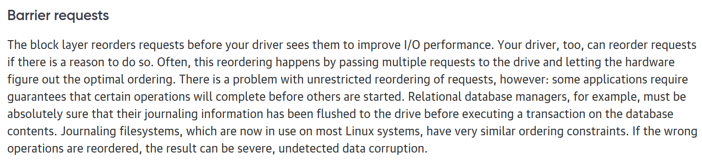

# Notes on block device interfaces

From https://en.wikipedia.org/wiki/Tagged_Command_Queuing :

From https://en.wikipedia.org/wiki/Native_Command_Queuing

From https://blog.westerndigital.com/nvme-queues-explained/

NOTE: many thousands of queues; reordering/out of order processing; 

From https://metebalci.com/blog/a-quick-tour-of-nvm-express-nvme/

## Latest NVMe spec

https://nvmexpress.org/wp-content/uploads/NVM-Express-1_4a-2020.03.09-Ratified.pdf

Summary: blk dev commands are submitted to queues (of which there may potentially be very many); flush is per queue

## Xen block device interface?

Some doc here: https://documentation.suse.com/sles/12-SP4/html/SLES-all/cha-cachemodes.html

Seems to suggest that flushing is per-device.

## Linux block device interface

From https://www.oreilly.com/library/view/linux-device-drivers/0596005903/ch16.html

## Summary

We can submit operations on queues; we may be able to request to be informed when an operation completes; operations can be reordered per-queue; a barrier prevents reordering across the barrier; a sync requests that the operations be made persistent.

## Simulating queues on conventional blk devices

We would like our filesystem to target an NVMe-like interface. However, existing blk devs typically support only a single sync operation (or, at least, this is what is usually expressible at the level we are working). So, emulating this interface on traditional blk devs will be rather costly.

